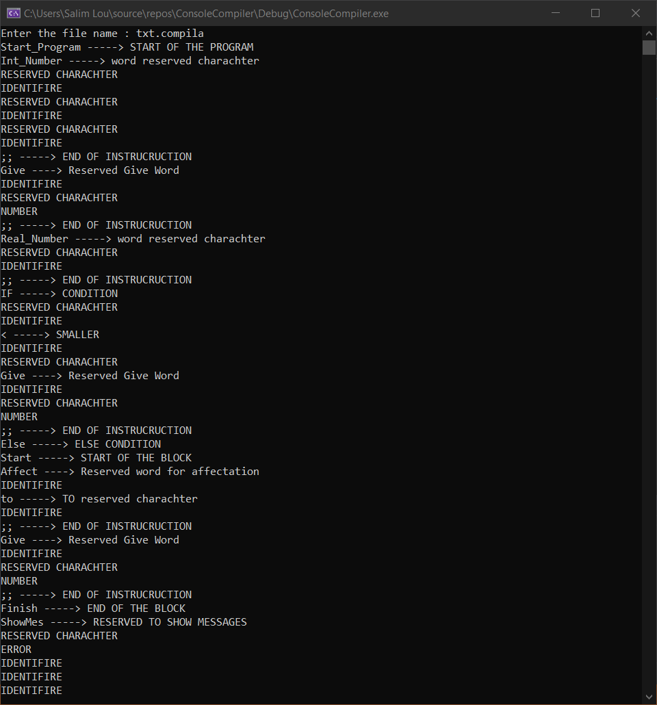

# .compila Compiler


after creating a language and a grammar ,
this program will read .compila files and apply the lexical ,syntaxic , symantic analysis 

### **Language Example :**

```
Start_Program
Int_Number : i , j , Aft_5 ;;
Give i : 23 ;;
Real_Number : Aft34_2 ;;
If -- i < j -- Give Aft_5 : 10 ;;
Else
    Start
        Affect i to j ;;
        Give Aft34_2 : 123.54 ;;
    Finish
ShowMes : " this is a message " ;;
ShowVal : i ;;
//. this is a comment
End_Program 
```         

### 1. Lexical analysis (consoleCompiler.cpp) :
we need to give every preDefined words a token :
- preDefined words means all reserved array of charachters ( String ) that doesn't change.
- token it's a way to detect the reserved word name.  

Reserved Words   | Token              |Reserved Words   | Token
-----------------|--------------------|-----------------|--------------------|
Start_Program    | START_PROGRAM      |End_Program      | END_PROGRAM        |
Int_Number       | INTEGER            |Give             | GIVE               |
Real_Number      | FLOAT              | If              | IF                 |
Affect           | AFFECT             |//.              | COMMENT            |
to               | TO                 |==               | EQUAL              |
ShowMes          | SHOW_MES           |--               | RESERVED_CHARACHTER|
ShowVal          | SHOW_VAL           |>=               | GTE                |
Start            | START              |<>               | NOT_EQUAL          |
Finish           | FINISH             |<=               | LTE                |
Else             | ELSE               |<                | SMALLER            |
,                | RESERVED_CHARACHTER|:                | RESERVED_CHARACHTER|
;;               | END_INSTRUCTION    |

- **Here is the implementation in c++ :** 
```c++
enum Tokens
{
START_PROGRAM,END_PROGRAM,COMMENT,END_INSTRUCTION,RESERVED_WORD,STRING,
INTEGER,FLOAT,IDENT,GIVE,AFFECT,RESERVED_CHARACHTER,IF,BIGGER,SMALLER,
EQUAL,NOT_EQUAL,ELSE,START,FINISH,SHOW_MES,SHOW_VAL,TO,END_FILE,LTE,
GTE,ERROR,NUMBER
};
```
after that with the given file.compila we need to acces the  data in and scan it.
- **read the file and scan that data using :**
```c++
ifstream f;
f.get();
```
- in the function
```c++ 
Tokens Scanner::getToken1()
``` 
it will scan charachter by charachter and return the given token. 
strings that aren't reserved words are 
1. ident
the function that detects ident in c++ :
```c++
else if (isalpha(ch))
{
	s += ch;
	f.get(ch);
	while (isalpha(ch) || ch == '_' || isdigit(ch))
		{
			s += ch;
			f.get(ch);
		}
		f.putback(ch);
		return checkReserved1(s);
}
``` 
2. integer number
the function that detects integer numbers in c++ :
```c++
else if (isdigit(ch))
{
	s = ch;
	f.get(ch);
	while (isdigit(ch))
	{
		s += ch;
		f.get(ch);
	}
	f.putback(ch);
	return Tokens::NUMBER;
}
```  
3. float number  
the function that detects float numbers in c++ :
```c++
else if (isdigit(ch))
{
	s = ch;
	f.get(ch);
	while (isdigit(ch) || ch == '.')
	{
        if(ch == '.'){c++;}
        if(c==2){ return Token::ERROR}
		s += ch;
		f.get(ch);
	}
	f.putback(ch);
	return Tokens::NUMBER;
}
```
all other are the same as this two code snippets .
after scanning all the file we will have all the tokens and iden's and numbers than we implement a switch to print every word if it's a reserved works and charachters and iden's ...
- **The c++ code :** 
```c++
void Scanner::displayTokens1()
{
	Tokens a;

	if (f.eof()) cout << "END OF FILE \n";
	while (!f.eof())
	{
		a = getToken1();
		switch (a)
		{
		case START_PROGRAM:        cout << "Start_Program -----> START OF THE PROGRAM\n";
			break;
		case END_PROGRAM:          cout << "End_Program -----> END OF PROGRAM\n";
			break;
		case COMMENT:              cout << "//. -----> COMMENT STARTER\n";
			break;
		case END_INSTRUCTION:      cout << ";; -----> END OF INSTRUCRUCTION \n";
			break;
		case RESERVED_WORD:        cout << "RESERVED WORD\n";
			break;
		case STRING:               cout << "STRING WORD\n";
			break;
		case INTEGER:              cout << "Int_Number -----> word reserved charachter\n";
			break;
		case FLOAT:                cout << "Real_Number -----> word reserved charachter\n";
			break;
		case IDENT:                cout << "IDENTIFIRE\n";
			break;
		case GIVE:                 cout << "Give ----> Reserved Give Word \n";
			break;
		case AFFECT:               cout << "Affect ----> Reserved word for affectation\n";
			break;
		case RESERVED_CHARACHTER:  cout << "RESERVED CHARACHTER\n";
			break;
		case IF:                   cout << "IF -----> CONDITION\n";
			break;
		case BIGGER:               cout << "> -----> BIGGER\n";
			break;
		case SMALLER:              cout << "< -----> SMALLER\n";
			break;
		case EQUAL:                cout << "== -----> EQUAL\n";
			break;
		case NOT_EQUAL:            cout << "<> -----> NOT EQUAL\n";
			break;
		case ELSE:                 cout << "Else -----> ELSE CONDITION\n";
			break;
		case START:                cout << "Start -----> START OF THE BLOCK\n";
			break;
		case FINISH:               cout << "Finish -----> END OF THE BLOCK\n";
			break;
		case SHOW_MES:             cout << "ShowMes -----> RESERVED TO SHOW MESSAGES\n";
			break;
		case SHOW_VAL:             cout << "ShowVal -----> RESERVED TO SHOW VARIABLES VALUES\n";
			break;
		case TO:                   cout << "to -----> TO reserved charachter\n";
			break;
		case LTE:                  cout << "<= -----> LESS THEN OR EQUAL reserved charachter\n";
			break;
		case GTE:                  cout << ">= -----> GREATER THAN OR EQUAL reserved charachter\n";  
			break;
		case NUMBER:               cout << "NUMBER\n";
			break;
		case END_FILE:             cout << "\n ============== THE END OF THE FILE ======================\n";
			break;
		case ERROR:                cout << "ERROR\n";
			break;
		}
	}
}
```
- **Here is the output reading txt.compila file :**


